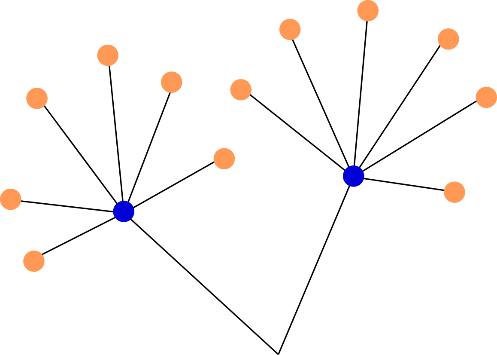

# Weather Routing Tool

## Installation instructions

The routing tool can be installed in two ways: via the file requirements.txt and via the file setup.py. If the latter option is chosen, the WRT can also be directly imported into other python packages.

### Installation via the requirements.txt

- generate a virtual environment e.g. via `python -m venv "venv"`
- activate the virtual environment: `source venv/bin/activate`
- install the routing tool: `pip install -r /path-to-WRT/requirements.txt`
- install the python package for downloading the environmental data: `pip install git+https://github.com/52North/MariGeoRoute#subdirectory=data/maridatadownloader`
- install mariPower:
  - request access to the respective git repository and clone it
  - open setup.py in maripower directory
  - delete requirement pickle
  - fix smt to version 1.3.0 (`smt==1.3.9`)
  - install maripower: `pip install -e maripower`

### Installation via the setup.py

- generate a virtual environment e.g. via `python3.9 -m venv "venv"`
- activate the virtual environment: `source venv/bin/activate`
- export the path variable for the WRT: `export WRT_PATH=/home/kdemmich/MariData/Code/MariGeoRoute/WeatherRoutingTool/`
- install the WRT: `/path/to/WRT/setup.py install`
- install mariPower:
  - request access to the respective git repository and clone it
  - open setup.py in maripower directory
  - delete the requirement pickle
  - fix smt to version 1.3.0 (`smt==1.3.9`)
  - install maripower: `pip install -e maripower`

### Run the software

Before running the WRT, the necessary input data needs to be setup. Please follow these steps:

1. For standalone execution, download weather data for the required time period from [here](https://maridata.dev.52north.org/EnvDataAPI/) in netCDF format. The parameters that need to be selected for the routing procedure are the following:
   - u-component_of_wind_height_above_ground (u-component of wind @ Specified height level above ground)
   - v-component_of_wind_height_above_ground (v-component of wind @ Specified height level above ground)
   - vtotal (Northward total velocity: Eulerian + Waves + Tide)
   - utotal (Eastward total velocity: Eulerian + Waves + Tide)
   - VHMO (spectral significant wave height @ sea surface)
   - VMDR (mean wave direction @ sea surface)
   - VTPK (wave period at spectral peak)
   - thetao (potential temperature)
   - Pressure_reduced_to_MSL_msl (pressure reduced to mean sea level)
   - Temperature_surface (temperature at the water surface)
   - so (salinity)
2. For standalone execution, download data on the water depth from [here](https://www.ngdc.noaa.gov/thredds/catalog/global/ETOPO2022/30s/30s_bed_elev_netcdf/catalog.html?dataset=globalDatasetScan/ETOPO2022/30s/30s_bed_elev_netcdf/ETOPO_2022_v1_30s_N90W180_bed.nc).
3. Define the environment variables which are read by config.py in the sections 'File paths' and 'Boat settings' (e.g. in a separate .env file). If you want to import the WRT into another python project, export the environment variables via doing

   ```sh
   source /home/kdemmich/MariData/Code/MariGeoRoute/WeatherRoutingTool/load_wrt.sh
   ```

4. Adjust the start and endpoint of the route as well as the departure time using the variables 'DEFAULT_ROUTE' and 'START_TIME'. The variable 'DEFAULT_MAP' needs to be set to a map size that encompasses the final route. The boat speed and draught can be configured via the variables 'BOAT_SPEED' and 'BOAT_DRAUGHT'.
5. Initiate the routing procedure by executing the file 'execute_routing.py' *out of the base directory*:

   ```sh
   python WeatherRoutingTool/execute_routing.py
   ```


## Utilised Conventions

  - latitude: -90° - 90°
  - longitude: -180° - 180°
  - headings: 0° - 360°, angular difference between North and the ship's direction, angles are going in the negative mathematical direction (clockwise)

## Logging

The routing tool writes log output using the python package logging.
Information about basic settings are written to a file which is specified by the environment variable `INFO_LOG_FILE`. Warnings and performance information are written to the file which is specified by the environment variable `PERFORMANCE_LOG_FILE`.
Further debug information are written to stdout.

## Isofuel Algorithm

### General concept

The routing process is divided into individual routing steps. For every step, the distance is calculated that the ship can travel following different courses with a specified amount of fuel and constant speed. Only those routes that maximise the travel distance for a constant amount of fuel are selected for the next routing step. This optimisation process is refered to as *pruning*. The distance between the start coordinates at the beginning of the routing step and the end coordinates after the step is refered to as *route segment*.

The algorithm is the following:

1. Define the amount of fuel *f<sub>max</sub>* that the ship can consume for every single routing step.
2. Consider a selection of courses outgoing from the start coordinate pair. For every course, calculate the fuel rate *f/t* (the amount of fuel consumed per time interval) that is necessary to keep the ship speed and course.
3. Based on *f/t*, *f<sub>max</sub>* and the ship speed, calulate the distance that is traveled for every route segment.
4. Divide the angular region into equally-sized segments -- the *pruning segments*. For every pruning segment, the end point of the route segment that maximises the distance is passed as a new starting point to the next routing step.
5. Repeat steps 2. to 4. until the distance of any route from the starting coordinates towards the destination is smaller than the length of the route segment from the current routing step.

Obviously, the amount of fuel *f<sub>max</sub>* that is provided to the algorithm determines the step width of the final route: the larger *f<sub>max</sub>*, the longer the route segments and the more edgy the final route. The number *n<sub>courses</sub>* of courses that is considered for every coordinate pair defines the resolution with which the area is searched for optimal routes. Thus, the smaller *n<sub>courses</sub>*, the larger the likelihood that more optimal routes exist than the final route provided. On the other hand, the larger *n<sub>courses</sub>* the larger is the calculation power. Further settings that can be defined are the area that is considered for the pruning as well as the number *n<sub>prune</sub>* of pruning segments. The later specifies the number of end points that are passed from one routing step to the next. The relation of *n<sub>courses</sub>* and *n<sub>prune</sub>* defines the degree of optimisation.

### Parameter and variable definitions

<figure>
  <p align="center">
  
  </p>
  <figcaption> Fig.2: Schema for the definition of the most important parameters names for the isofuel algorithm.</figcaption>
</figure>
<br>
<br>

ISOCHRONE_PRUNE_SEGMENTS = number of segments that are used for the pruning process</br>
ISOCHRONE_PRUNE_SECTOR_DEG_HALF = angular range of azimuth angle that is considered for pruning (only one half of it!)</br>
ROUTER_HDGS_SEGMENTS = total number of courses/azimuths/headings that are considered per coordinate pair for every routing step</br>
ROUTER_HDGS_INCREMENTS_DEG = angular distance between two adjacent routing segments</br>

heading/course/azimuth/variants = the angular distance towards North on the grand circle route </br>
lats_per_step: (M,N) array of latitudes for different routes (shape N=headings+1) and routing steps (shape M=steps,decreasing)</br>
lons_per_step: (M,N) array of longitude for different routes (shape N=headings+1) and routing steps (shape M=steps,decreasing)

## Fuel estimation -- The communication between mariPower and the WRT

Information is transfered via a netCDF file between the WRT and mariPower. The coordinate pairs, courses, the ship speed and the time for which the power estimation needs to be performed are written to this file by the WRT. This information is read by mariPower, the calculation of the ship parameters is performed and the corresponding results are added as separate variables to the xarray dataset. The structure of the xarray dataset after the ship parameters have been written is the following:

```sh
Dimensions:                    (it_pos: 2, it_course: 3)
Coordinates:
   * it_pos                    (it_pos) int64 1 2
   * it_course                 (it_course) int64 1 2 3
Data variables:
    courses                    (it_pos, it_course) float64 ...
    speed                      (it_pos, it_course) int64 ...
    lat                        (it_pos) float64 ...
    lon                        (it_pos) float64 ...
    time                       (it_pos) datetime64[ns] ...
    Power_delivered            (it_pos, it_course) float64 ...
    RotationRate               (it_pos, it_course) float64 ...
    Fuel_consumption_rate      (it_pos, it_course) float64 ...
    Calm_resistance            (it_pos, it_course) float64 ...
    Wind_resistance            (it_pos, it_course) float64 ...
    Wave_resistance            (it_pos, it_course) float64 ...
    Shallow_water_resistance   (it_pos, it_course) float64 ...
    Hull_roughness_resistance  (it_pos, it_course) float64 ...
```

The coordinates `it_pos` and `it_course` are iterators for the coordinate pairs and the courses that need to be checked per coordinate pair, respectively. The function in the WRT that writes the route parameters to the netCDF file is called `ship.write_netCDF_courses`. Following up on this, the function `get_fuel_netCDF` in the WRT calls the function `PredictPowerOrSpeedRoute` in mariPower which itself initiates the calcualation of the ship parameters. The netCDF file is overwritten by the WRT for every routing step s.t. the size of the file is not increasing during the routing process.

<figure>
  <p align="center">
  
  </p>
  <figcaption> Fig.2 Schema to visualise which coordinate pairs are send in a combined request to mariPower for fuel estimation in case of the isofuel algorithm. All coordinate pairs marked by orange filled circles are send for the second routing step. Coordinate pairs marked with blue filled circles are endpoints after the first routing step that survived the pruning. </figcaption>
</figure>
<br>
<br>
<figure>
  <p align="center">
  
  </p>
  <figcaption> Fig.3 Schema to visualise which coordinate pairs are send in a combined request to mariPower for fuel estimation in case of the genertic algorithm. All coordinate pairs marked by the same colour are send in one request. </figcaption>
</figure>
<br>
<br>

Both for the isofuel algorithm and the genetic algorithm the same structure of the netCDF file is used. However, due to the different concepts of the algorithms, the entity of points that is send for calculation in one request differes between both algorithms. For the isofuel algorithm, all coordinate pairs and courses that are considered for a single routing step are passed to mariPower in a single request (see Fig. 2). For the genetic algorithm all points and courses for a closed route are passed in a single request (see Fig. 3).

## The constraints module

### The input parameters

<figure>
  <p align="center">
  
  </p>
  <figcaption> Fig.4 Figure for illustrating the concept of passing the information on the routing segments that are to be checked by the constraint module to the respective function. Variable names printed in orange correspond to the naming scheme for the first routing step while variables printed in blue correspond to the naming scheme for the second routing step. </figcaption>
</figure>
<br>
<br>

As described above [ToDo], the constraint module can be used to check constraints for a complete routing segment. Thereby, several routing segments can be processed in only one request. This means that for the genetic algorithm, only one request needs to be performed for every route that is considered in a single generation and for the isofuel algorithm, only one request needs to be performed for every single routing step. This implementation minimises computation time and is achieved by passing arrays of latitudes and longitudes to the constraint module i.e. if the constraint module is called like this

```python
   safe_crossing(lat_start, lat_end, lon_start, lon_end)
```

then, the arguments `lat_start`, `lat_end`, `lon_start` and `lon_end` correspond to arrays for which every element characterises a different routing segment. Thus the length of the arrays is equal to the number of routing segments that are to be checked. While for the genetic algorithm, the separation of a closed route into different routing segments is rather simple, the separation for the isofuel algorithm is more complex. This is, why the passing of the latitudes and longitudes shall be explained in more detail for the isofuel algorithm in the following.

Let's consider only two routing steps of the form that is sketched in Fig. XXX. The parameters that are passed to the constraints module for the first routing step are the latitudes and longitudes of start and end points for the routing segments _a_ to _e_ which are

- lat_start = (lat_start<sub>abcde</sub>, lat_start<sub>abcde</sub>, lat_start<sub>abcde</sub>, lat_start<sub>abcde</sub>, lat_start<sub>abcde</sub>)
- lat_end = (lat_end<sub>a</sub>, latend<sub>b</sub>, latend<sub>c</sub>, latend<sub>d</sub>, latend<sub>e</sub>)
- lon_start = (lon_start<sub>abcde</sub>, lon_start<sub>abcde</sub>, lon_start<sub>abcde</sub>, lon_start<sub>abcde</sub>, lon_start<sub>abcde</sub>)
- lon_end = (lon_end<sub>a</sub>, lon_end<sub>b</sub>, lon_end<sub>c</sub>, lon_end<sub>d</sub>, lon_end<sub>e</sub>)

i.e. since the start coordinates are matching for all routing segments, the elements for the start latitudes and longitudes are all the same.<br>
The arguments that are passed for the second routing step are the start and end coordinates of the routing segments &#945; to &#950;:

- lat_start = (lat_start<sub>&#945;&#946;&#947;</sub>, lat_start<sub>&#945;&#946;&#947;</sub>,lat_start<sub>&#945;&#946;&#947;</sub>,lat_start<sub>&#948;&#949;&#950;</sub>, lat_start<sub>&#948;&#949;&#950;</sub>,lat_start<sub>&#948;&#949;&#950;</sub>)
- lat_end = (lat_end<sub>&#945;</sub>, lat_end<sub>&#946;</sub>,lat_end<sub>&#947;</sub>,lat_end<sub>&#948;</sub>, lat_end<sub>&#949;</sub>,lat_end<sub>&#950;</sub>)
- lon_start = (lon_start<sub>&#945;&#946;&#947;</sub>, lon_start<sub>&#945;&#946;&#947;</sub>,lon_start<sub>&#945;&#946;&#947;</sub>,lon_start<sub>&#948;&#949;&#950;</sub>, lon_start<sub>&#948;&#949;&#950;</sub>,lon_start<sub>&#948;&#949;&#950;</sub>)
- lon_end =  (lon_end<sub>&#945;</sub>, lon_end<sub>&#946;</sub>,lon_end<sub>&#947;</sub>,lon_end<sub>&#948;</sub>, lon_end<sub>&#949;</sub>,lon_end<sub>&#950;</sub>)

i.e. the latitudes of the end points from the first routing step are now the start coordinates of the current routing step. In contrast to the first routing step, the start coordinates of the second routing step differ for several route segments.

## References

- <https://github.com/omdv/wind-router>
- [Henry H.T. Chen's PhD Thesis](http://resolver.tudelft.nl/uuid:a6112879-4298-40a6-91c7-d9a431a674c7)
- Modeling and Optimization Algorithms in Ship Weather Routing, doi:10.1016/j.enavi.2016.06.004
- Optimal Ship Weather Routing Using Isochrone Method on the Basis of Weather Changes, doi:10.1061/40932(246)435
- Karin, Todd. Global Land Mask. October 5, 2020. doi:10.5281/zenodo.4066722
- [GFS grib2 filter](https://nomads.ncep.noaa.gov/)
- [Boat polars - 1](https://jieter.github.io/orc-data/site/)
- [Boat polars - 2](https://l-36.com/polar_polars.php)
- <https://en.wikisource.org/wiki/The_American_Practical_Navigator/Chapter_1>
- <https://gist.github.com/jeromer/2005586>
- <https://towardsdatascience.com/calculating-the-bearing-between-two-geospatial-coordinates-66203f57e4b4>
- <https://www.youtube.com/watch?v=DeFZ6AHtYxg>
- <https://www.movable-type.co.uk/scripts/latlong.html>
- <https://gis.stackexchange.com/questions/425515/converting-between-lat-long-azimuth-and-distance-heading>
- <https://geopy.readthedocs.io/en/stable/>
- <https://www.siranah.de/html/sail020f.html>
- <https://github.com/hakola/marine-traffic-modelling>
- <http://www.movable-type.co.uk/scripts/latlong.html?from=48.955550,-122.05169&to=48.965496,-122.072989>
- <https://geographiclib.sourceforge.io/html/python/code.html#geographiclib.geodesic.Geodesic.Inverse>
- <https://mathsathome.com/calculating-bearings/>

## Funding

| Project/Logo | Description |
| :-------------: | :------------- |
| [](https://www.maridata.org/) | MariGeoRoute is funded by the German Federal Ministry of Economic Affairs and Energy (BMWi)[](https://www.bmvi.de/) |
