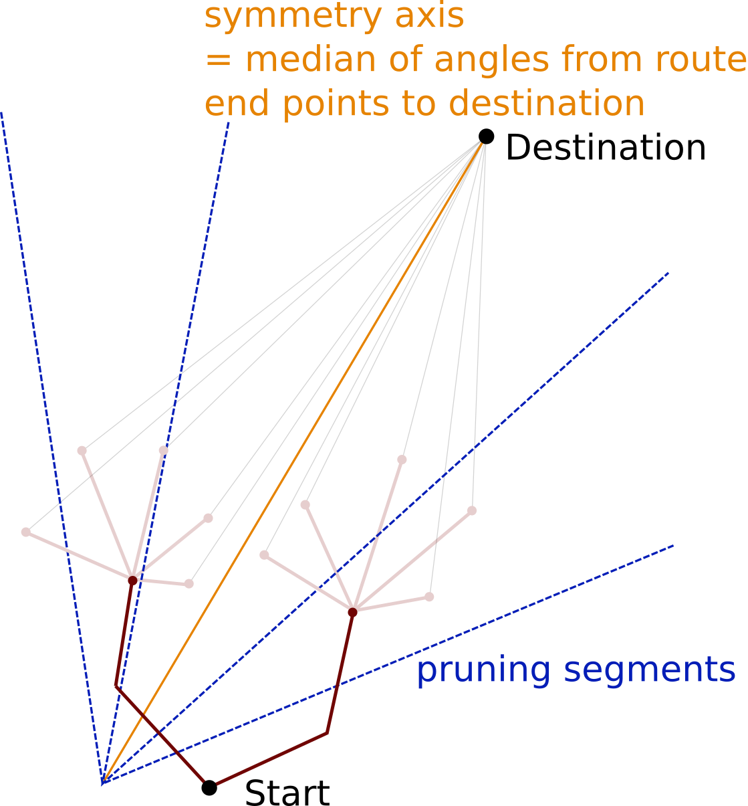
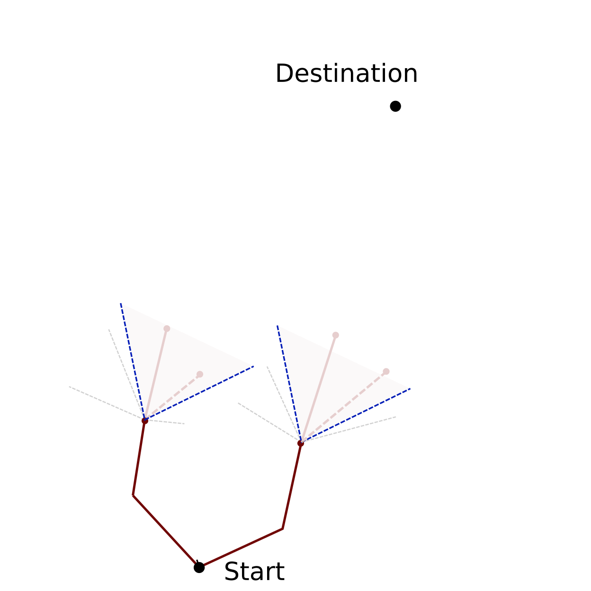
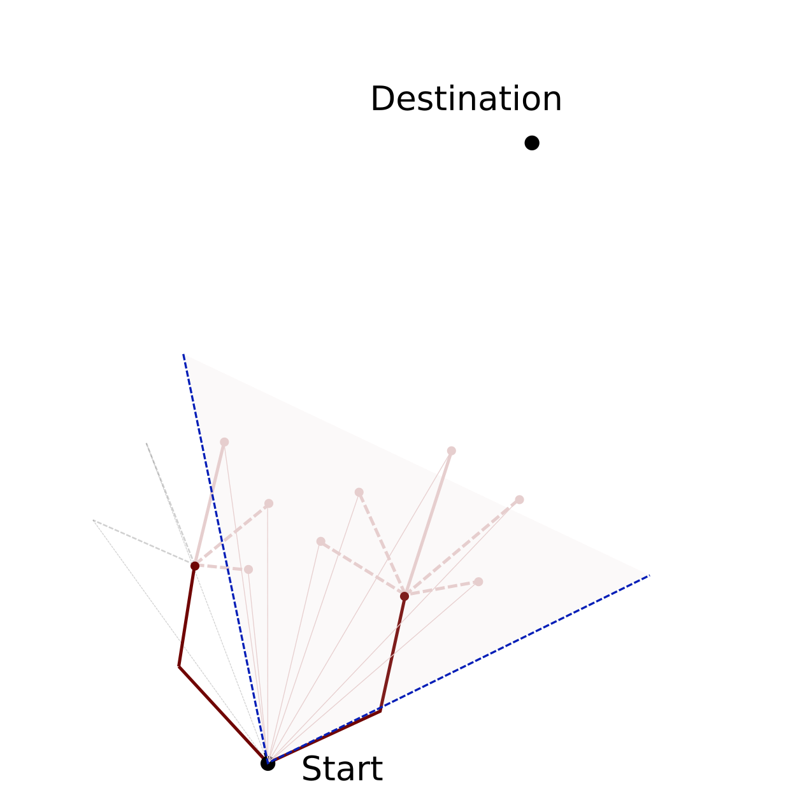
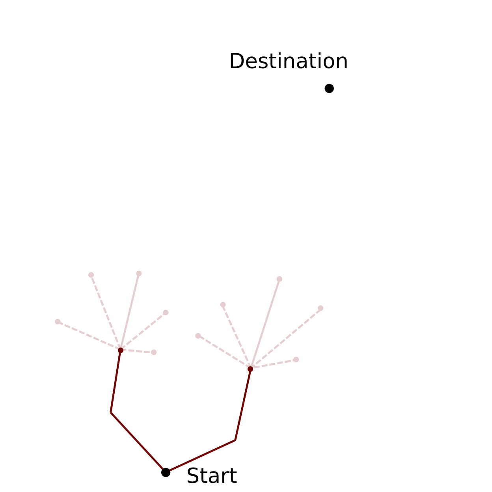
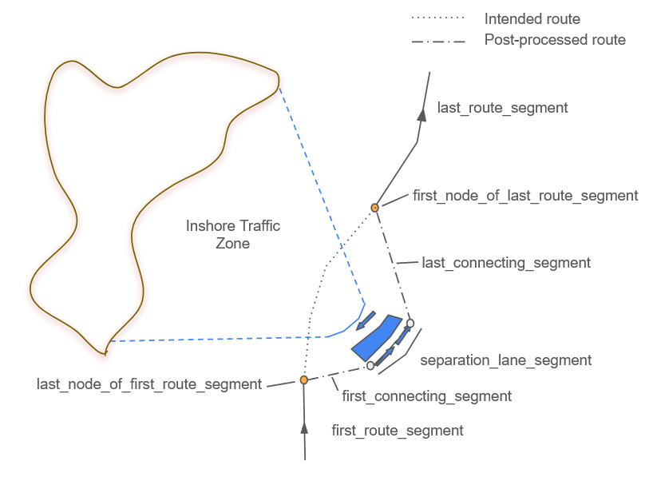

# Weather Routing Tool (WRT)

## Installation instructions

Steps:
- clone the repository: `git clone https://github.com/52North/WeatherRoutingTool.git`
- change to the folder: `cd WeatherRoutingTool`
- [recommended] create and activate a virtual environment, e.g.
  - `python3 -m venv "venv"`
  - `source venv/bin/activate`
- install the WRT: `pip install .` or in editable mode (recommended for development) `pip install -e .`

**Power/fuel consumption framework**

In order to get high-quality results, a suitable power/fuel modelling framework should be used as it is the core of any weather routing optimization.

The WRT was originally implemented within the research project [MariData](https://maridata.org/en/start_en). Within this project the power/fuel modelling framework **mariPower** was developed by project partners from the [Institute of Fluid Dynamics and Ship Theory](https://www.tuhh.de/fds/home) of the Hamburg University of Technology.
The mariPower package allows to predict engine power and fuel consumption under various environmental conditions for specific ships investigated in the project. More details about the package and the project as a whole can be found in the following publication: [https://proceedings.open.tudelft.nl/imdc24/article/view/875](https://proceedings.open.tudelft.nl/imdc24/article/view/875).  
The mariPower package is closed source software and this will most likely not change in the future. However, as power demand varies from ship to ship users have to provide code for making power predictions on their own suitable to the use case.

For users with access to mariPower:
- clone the repository
- change to the folder: `cd maripower`
- install mariPower: `pip install .` or `pip install -e .`

For users without access to mariPower:

One way to quickly test the WRT without mariPower is to use the configuration `ALGORITHM_TYPE='speedy_isobased'` and specifying the config parameter `'CONSTANT_FUEL_RATE'`. This will assume a constant fuel rate of the vessel in any condition (high waves, low waves, etc.) and at any time. Of course, results will be highly inaccurate, but it is a way to quickly try and test the code and get some first ideas of possible routes.

New ships with their own power/fuel model can be integrated by implementing a new [ship class](https://github.com/52North/WeatherRoutingTool/blob/main/WeatherRoutingTool/ship/ship.py) and using it in the config.

In the future, it would be interesting to integrate general empirical formulas for power demand which provide reasonable results based on a small set of general ship parameters provided by the user like length and draft of the ship. However, for optimal results it is necessary to have a power prediction framework specifically designed for the ship(s) investigated. This could be based, e.g., on physical laws or data driven.

## Configure and run the tool

Configuration of the Weather Routing Tool can be done by providing a json file. An example is given by `config.example.json`.

The configuration file has to be provided when calling the Weather Routing Tool from the command line:
```shell
python3 WeatherRoutingTool/cli.py -f <path>/config.json
```

Additionally, it's possible to define files for logging (separately for info and warning level) and if debugging mode should be used.
Check the help text to get an overview of all CLI arguments:
```shell
$ python WeatherRoutingTool/cli.py --help
usage: cli.py [-h] -f FILE [--warnings-log-file WARNINGS_LOG_FILE] [--info-log-file INFO_LOG_FILE] [--debug DEBUG] [--filter-warnings FILTER_WARNINGS]

Weather Routing Tool

options:
  -h, --help            show this help message and exit
  -f FILE, --file FILE  Config file name (absolute path)
  --warnings-log-file WARNINGS_LOG_FILE
                        Logging file name (absolute path) for warnings and above.
  --info-log-file INFO_LOG_FILE
                        Logging file name (absolute path) for info and above.
  --debug DEBUG         Enable debug mode. <True|False>. Defaults to 'False'.
  --filter-warnings FILTER_WARNINGS
                        Filter action. <default|error|ignore|always|module|once>.Defaults to 'default'.
```

Some variables have to be set using environment variables (see below).

### Config file

The following lists contain information on each variable which can be set.

**Required variables** (no default values provided):
- `COURSES_FILE`: path to file that acts as intermediate storage for courses per routing step
- `DEFAULT_MAP`: bbox in which route optimization is performed (lat_min, lon_min, lat_max, lon_max)
- `DEFAULT_ROUTE`: start and end point of the route (lat_start, lon_start, lat_end, lon_end)
- `DEPARTURE_TIME`: start time of travelling, format: 'yyyy-mm-ddThh:mmZ'
- `DEPTH_DATA`: path to depth data (Attention: if `DATA_MODE` is `automatic` or `odc`, this file will be overwritten!)
- `ROUTE_PATH`: path to json file to which the route will be written
- `WEATHER_DATA`: path to weather data (Attention: if `DATA_MODE` is `automatic` or `odc`, this file will be overwritten!)

**Recommended variables** (default values provided but might be inaccurate/unsuitable):
- `BOAT_DRAUGHT_AFT`: aft draught (draught at rudder) in m
- `BOAT_DRAUGHT_FORE`: fore draught (draught at forward perpendicular) in m
- `BOAT_ROUGHNESS_DISTRIBUTION_LEVEL`: numeric value (default: 1)
- `BOAT_ROUGHNESS_LEVEL`: numeric value (default: 1)
- `BOAT_SPEED`: in m/s
- `DATA_MODE`: options: 'automatic', 'from_file', 'odc'

**Optional variables** (default values provided and don't need to be changed normally):
- `ALGORITHM_TYPE`: options: 'isofuel'
- `CONSTRAINTS_LIST`: options: 'land_crossing_global_land_mask', 'land_crossing_polygons', 'seamarks', 'water_depth', 'on_map', 'via_waypoints', 'status_error'
- `DELTA_FUEL`: amount of fuel per routing step (kg)
- `DELTA_TIME_FORECAST`: time resolution of weather forecast (hours)
- `FACTOR_CALM_WATER`: multiplication factor for the calm water resistance model
- `FACTOR_WAVE_FORCES`: multiplication factor for the added resistance in waves model
- `FACTOR_WIND_FORCES`: multiplication factor for the added resistance in wind model
- `GENETIC_MUTATION_TYPE`: type for mutation (options: 'grid_based')
- `GENETIC_NUMBER_GENERATIONS`: number of generations for genetic algorithm
- `GENETIC_NUMBER_OFFSPRINGS`: number of offsprings for genetic algorithm
- `GENETIC_POPULATION_SIZE`: population size for genetic algorithm
- `GENETIC_POPULATION_TYPE`: type for initial population (options: 'grid_based', 'from_geojson')
- `INTERMEDIATE_WAYPOINTS`: [[lat_one,lon_one], [lat_two,lon_two] ... ]
- `ISOCHRONE_MAX_ROUTING_STEPS`: maximum number of routing steps. Applies also if more than one route is searched!
- `ISOCHRONE_MINIMISATION_CRITERION`: options: 'dist', 'squareddist_over_disttodest'
- `ISOCHRONE_NUMBER_OF_ROUTES`: integer specifying how many routes should be searched (default: 1)
- `ISOCHRONE_PRUNE_GROUPS`: can be 'courses', 'larger_direction', 'branch'
- `ISOCHRONE_PRUNE_SECTOR_DEG_HALF`: half of the angular range of azimuth angle considered for pruning; not used for branch-based pruning
- `ISOCHRONE_PRUNE_SEGMENTS`: total number of azimuth bins used for pruning in prune sector; not used for branch-based pruning
- `ISOCHRONE_PRUNE_SYMMETRY_AXIS`: symmetry axis for pruning. Can be 'gcr' or 'headings_based'; not used for branch-based pruning
- `ROUTER_HDGS_INCREMENTS_DEG`: increment of headings
- `ROUTER_HDGS_SEGMENTS`: total number of headings (put even number!!); headings are oriented around the great circle from current point to (temporary - i.e. next waypoint if used) destination
- `ROUTE_POSTPROCESSING`: enable route postprocessing to follow the Traffic Separation Scheme in route postprocessing
- `SHIP_TYPE`: options: 'CBT', 'SAL'
- `TIME_FORECAST`: forecast hours weather

### Environment variables

Credentials for the Copernicus Marine Environment Monitoring Service (CMEMS) to download weather/ocean data:

- `CMEMS_USERNAME`
- `CMEMS_PASSWORD`

If not provided `DATA_MODE='automatic'` cannot be used.

Configuration parameters for the database which stores OpenSeaMap data:

- `WRT_DB_HOST`
- `WRT_DB_PORT`
- `WRT_DB_DATABASE`
- `WRT_DB_USERNAME`
- `WRT_DB_PASSWORD`

If not provided the 'land_crossing_polygons' and 'seamarks' options of `CONSTRAINTS_LIST` and `ROUTE_POSTPROCESSING=True` cannot be used.

Path for storing figures (mainly for debugging purposes):

- `WRT_FIGURE_PATH`

If not set or the path doesn't exist or access rights are wrong, no figures will be saved.

You can define the environment variables in a separate .env file and call the provided shell script:
```sh
source <path-to-WRT>/load_wrt.sh
```

### Logging and Debugging

All log messages are sent to stdout by default. In addition, info and warning logs can be saved separately to file.
Debugging mode can be enabled (disabled by default) which sets the stream (stdout) logging level to debug.

The top-level logger is named "WRT". Child loggers are following the scheme "WRT.<child-name>".
They inherit the top-level loggers' logging level.

### Input data

Depending on the power/fuel consumption model used, different sets of environmental data are needed. The data described below are needed for the usage of **mariPower**.

There are three general options on how to provide the necessary input data:

1. The easiest option is to set the config parameter `DATA_MODE='automatic'`. To use it, valid CMEMS credentials have to be configured using system environment variables (see above). In this case, the WRT will automatically download the necessary weather and ocean data for the chosen temporal and spatial extent and store it in the file specified by the config variable `WEATHER_DATA`. Moreover, water depth data from [NOAA](https://www.ngdc.noaa.gov/thredds/catalog/global/ETOPO2022/30s/30s_bed_elev_netcdf/catalog.html?dataset=globalDatasetScan/ETOPO2022/30s/30s_bed_elev_netcdf/ETOPO_2022_v1_30s_N90W180_bed.nc) is downloaded and stored in the file specified by the config variable `DEPTH_DATA`.

2. It is also possible to prepare two NetCDF files containing the weather and ocean data and the water depth data and pointing the WRT to these files using the same config variables as before. To do so set `DATA_MODE='from_file'`. Be sure the temporal and spatial extent is consistent with the other config variables. The [maridatadownloader](https://github.com/52North/maridatadownloader) - which is used by the WRT - can facilitate the preparation.

3. A third option is to set up an [Open Data Cube (ODC)](https://www.opendatacube.org/) instance. To use it set `DATA_MODE='odc'`. In this case, the data will be extracted from ODC and also stored in the two files as described before.

Be sure that the water depth data is available and configured correctly in order to use the `water_depth` option of `CONSTRAINTS_LIST`.

The following parameters are downloaded automatically or need to be prepared:
- u-component_of_wind_height_above_ground (u-component of wind @ Specified height level above ground)
- v-component_of_wind_height_above_ground (v-component of wind @ Specified height level above ground)
- vtotal (Northward total velocity: Eulerian + Waves + Tide)
- utotal (Eastward total velocity: Eulerian + Waves + Tide)
- VHMO (spectral significant wave height @ sea surface)
- VMDR (mean wave direction @ sea surface)
- VTPK (wave period at spectral peak)
- thetao (potential temperature)
- Pressure_reduced_to_MSL_msl (pressure reduced to mean sea level)
- Temperature_surface (temperature at the water surface)
- so (salinity)


## Conventions

### Coordinates

  - latitude: -90° - 90°
  - longitude: -180° - 180°
  - headings: 0° - 360°, angular difference between North and the ship's direction, angles are going in the negative mathematical direction (clockwise)

### Units

Apart from one exception, the WRT uses SI units for internal calculations. Only angles are handled in degrees as defined in the paragraph above. All input variables that carry a unit are converted according to these definitions. For the output -- i.e. when a route is written to a json file -- the engine power is converted to kW and the fuel rate to mt/h, where mt refers to *metric ton*. <br><br>
The WRT uses the package [astropy](https://docs.astropy.org/en/stable/units/) for the convenient handling of units.

## Logging

The routing tool writes log output using the python package logging.
Information about basic settings are written to a file which is specified by the environment variable `INFO_LOG_FILE`. Warnings and performance information are written to the file which is specified by the environment variable `PERFORMANCE_LOG_FILE`.
Further debug information are written to stdout.

## Isofuel Algorithm

### General concept

The routing process is divided into individual routing steps. For every step, the distance is calculated that the ship can travel following different courses with a specified amount of fuel and constant speed. Only those routes that maximise the travel distance for a constant amount of fuel are selected for the next routing step. This optimisation process is referred to as *pruning*. The distance between the start coordinates at the beginning of the routing step and the end coordinates after the step is referred to as *route segment*.

The algorithm is the following:

1. Define the amount of fuel *f<sub>max</sub>* that the ship can consume for every single routing step.
2. Consider a selection of courses outgoing from the start coordinate pair. For every course, calculate the fuel rate *f/t* (the amount of fuel consumed per time interval) that is necessary to keep the ship speed and course.
3. Based on *f/t*, *f<sub>max</sub>* and the ship speed, calulate the distance that is traveled for every route segment.
4. Divide the angular region into equally-sized segments -- the *pruning segments*. For every pruning segment, the end point of the route segment that maximises the distance is passed as a new starting point to the next routing step.
5. Repeat steps 2. to 4. until the distance of any route from the starting coordinates towards the destination is smaller than the length of the route segment from the current routing step.

Obviously, the amount of fuel *f<sub>max</sub>* that is provided to the algorithm determines the step width of the final route: the larger *f<sub>max</sub>*, the longer the route segments and the more edgy the final route. The number *n<sub>courses</sub>* of courses that is considered for every coordinate pair defines the resolution with which the area is searched for optimal routes. Thus, the smaller *n<sub>courses</sub>*, the larger the likelihood that more optimal routes exist than the final route provided. On the other hand, the larger *n<sub>courses</sub>* the larger is the calculation power. Further settings that can be defined are the area that is considered for the pruning as well as the number *n<sub>prune</sub>* of pruning segments. The later specifies the number of end points that are passed from one routing step to the next. The relation of *n<sub>courses</sub>* and *n<sub>prune</sub>* defines the degree of optimisation.

### Parameter and variable definitions

<figure>
  <p align="center">
  
  </p>
  <figcaption> Fig.2: Schema for the definition of the most important parameters names for the isofuel algorithm.</figcaption>
</figure>
<br>
<br>

ISOCHRONE_PRUNE_SEGMENTS = number of segments that are used for the pruning process</br>
ISOCHRONE_PRUNE_SECTOR_DEG_HALF = angular range of azimuth angle that is considered for pruning (only one half of it!)</br>
ROUTER_HDGS_SEGMENTS = total number of courses/azimuths/headings that are considered per coordinate pair for every routing step</br>
ROUTER_HDGS_INCREMENTS_DEG = angular distance between two adjacent routing segments</br>

heading/course/azimuth/variants = the angular distance towards North on the grand circle route </br>
lats_per_step: (M,N) array of latitudes for different routes (shape N=headings+1) and routing steps (shape M=steps,decreasing)</br>
lons_per_step: (M,N) array of longitude for different routes (shape N=headings+1) and routing steps (shape M=steps,decreasing)

## Pruning methods
The pruning is the basis of the optimisation process for the isofuel algorithm. There exist three major concepts that can be used to adjust the pruning:

1. The definition of the angular region that is used for the pruning. This is specified by the number of pruning segments, the reach of the pruning sector and, most importantly, the angle around which the pruning segments are centered -- in the following refered to as *symmetry axis*
2. The choice of how route segments are grouped for the pruning.
3. The minimisation criterion that is used as basis for the pruning.

### The Definition of the Symmetry Axis
Two methods for the definition of the symmetry axis can be selected:

1. The symmetry axis is defined by the grand circle distance between the start point and the destination. In case intermediate waypoints have been defined, the intermediat start and end point are utilised.
2. The symmetry axis is defined by the median of the angles  with respect to North of the connecting lines between the end of the route segments and the destination.

<figure>
  <p align="center">
  
  </p>
  <figcaption> Fig.3: The symmetry axis of the pruning is given by the grand circle distance between global start and end point.</figcaption>
</figure>
<br>
<br>


<figure>
  <p align="center">
  
  </p>
  <figcaption> Fig.4: The symmetry axis of the pruning is given by the median of the angles of the connecting lines between the end of the route segments and the destination.</figcaption>
</figure>
<br>
<br>

### Grouping Route Segments
Route segments are organised in groups before the pruning is performed. Segments that lie outside of the pruning sector (shaded pink area in figures below) are exclueded from the pruning (dashed grey lines). The segment of one group that performs best regarding the minimisation criterion, survives the pruning process (solid pink lines). Three possibilities are available for grouping the route segments for the pruning:

1. *courses-based*:  Route segments are grouped according to their courses.
  <figure>
  <p align="center">
  
  </p>
</figure>
<br>
<br>

2. *larger-direction-based*: Route segments are grouped accoding to the angle of the connecting line between the global start point and the end of the route segment.
<figure>
  <p align="center">
  
  </p>
</figure>
<br>
<br>

4. *branch-based*: Route segments of one *branch* form a group. Thus all route segments are considered for the pruning. For a particular routing step, a branch is the entity of route segments that originate from one common point.
<figure>
  <p align="center">
  
  </p>
</figure>
<br>
<br>

### The Minimisation Criterion
*to be continued*

## Genetic Algorithm

### General concept

Five phases:
1. Initial population
   - Consists of candidate solutions (also called individuals) which have a set of properties (also called parameters, variables, genes)
1. Fitness function (evaluation)
1. Selection
1. Crossover
1. Mutation

Abort criteria:
- Maximum number of generations
- Satisfactory fitness level has been reached

### Routing Problem

Phases:
1. Initial population
   - route_through_array
. Fitness function (evaluation)
   - mariPower
1. Selection
1. Crossover
   - only routes which cross geometrically are used for crossover
1. Mutation
   - in principle random but can be restricted

### Useful links:

 - https://pymoo.org/index.html
 - monitoring convergence (e.g. using Running Matrix):
    - https://pymoo.org/getting_started/part_4.html
    - https://ieeexplore.ieee.org/document/9185546

### Variable definitions: debug output
 - n_gen: current generation
 - n_nds: number of non-dominating solutions
 - cv_min: minimum constraint violation
 - cv_avg: average constraint violation
 - eps: epsilon?
 - indicator: indicator to monitor algorithm performance; can be Hypervolume, Running Metric ...

### General Notes:
 - res.F = None: quick-and-dirty hack possible by passing 'return_least_infeasible = True' to init function of NSGAII
 - chain of function calls until RoutingProblem._evaluate() is called:
   - core/algorithms.run -> core/algorithms.next -> core/evaluator.eval -> core/evaluator._eval
 - chain of function calls until crossover/mutation/selection are called:
   - core/algorithms.run -> core/algorithms.next -> core/algorithm.infill -> algorithms/base/genetic._infill


## Fuel estimation -- The communication between mariPower and the WRT

Information is transferred via a netCDF file between the WRT and mariPower. The coordinate pairs, courses, the ship speed and the time for which the power estimation needs to be performed are written to this file by the WRT. This information is read by mariPower, the calculation of the ship parameters is performed and the corresponding results are added as separate variables to the xarray dataset. The structure of the xarray dataset after the ship parameters have been written is the following:

```sh
Dimensions:                    (it_pos: 2, it_course: 3)
Coordinates:
   * it_pos                    (it_pos) int64 1 2
   * it_course                 (it_course) int64 1 2 3
Data variables:
    courses                    (it_pos, it_course) float64 ...
    speed                      (it_pos, it_course) int64 ...
    lat                        (it_pos) float64 ...
    lon                        (it_pos) float64 ...
    time                       (it_pos) datetime64[ns] ...
    Power_delivered            (it_pos, it_course) float64 ...
    RotationRate               (it_pos, it_course) float64 ...
    Fuel_consumption_rate      (it_pos, it_course) float64 ...
    Calm_resistance            (it_pos, it_course) float64 ...
    Wind_resistance            (it_pos, it_course) float64 ...
    Wave_resistance            (it_pos, it_course) float64 ...
    Shallow_water_resistance   (it_pos, it_course) float64 ...
    Hull_roughness_resistance  (it_pos, it_course) float64 ...
```

The coordinates `it_pos` and `it_course` are iterators for the coordinate pairs and the courses that need to be checked per coordinate pair, respectively. The function in the WRT that writes the route parameters to the netCDF file is called `ship.write_netCDF_courses`. Following up on this, the function `get_fuel_netCDF` in the WRT calls the function `PredictPowerOrSpeedRoute` in mariPower which itself initiates the calcualation of the ship parameters. The netCDF file is overwritten by the WRT for every routing step s.t. the size of the file is not increasing during the routing process.

<figure>
  <p align="center">
  
  </p>
  <figcaption> Fig.2 Schema to visualise which coordinate pairs are send in a combined request to mariPower for fuel estimation in case of the isofuel algorithm. All coordinate pairs marked by orange filled circles are send for the second routing step. Coordinate pairs marked with blue filled circles are endpoints after the first routing step that survived the pruning. </figcaption>
</figure>
<br>
<br>
<figure>
  <p align="center">
  
  </p>
  <figcaption> Fig.3 Schema to visualise which coordinate pairs are send in a combined request to mariPower for fuel estimation in case of the genertic algorithm. All coordinate pairs marked by the same colour are send in one request. </figcaption>
</figure>
<br>
<br>

Both for the isofuel algorithm and the genetic algorithm the same structure of the netCDF file is used. However, due to the different concepts of the algorithms, the entity of points that is send for calculation in one request differes between both algorithms. For the isofuel algorithm, all coordinate pairs and courses that are considered for a single routing step are passed to mariPower in a single request (see Fig. 2). For the genetic algorithm all points and courses for a closed route are passed in a single request (see Fig. 3).

## The constraints module

### The input parameters

<figure>
  <p align="center">
  
  </p>
  <figcaption> Fig.4 Figure for illustrating the concept of passing the information on the routing segments that are to be checked by the constraint module to the respective function. Variable names printed in orange correspond to the naming scheme for the first routing step while variables printed in blue correspond to the naming scheme for the second routing step. </figcaption>
</figure>
<br>
<br>

As described above [ToDo], the constraint module can be used to check constraints for a complete routing segment. Thereby, several routing segments can be processed in only one request. This means that for the genetic algorithm, only one request needs to be performed for every route that is considered in a single generation and for the isofuel algorithm, only one request needs to be performed for every single routing step. This implementation minimises computation time and is achieved by passing arrays of latitudes and longitudes to the constraint module i.e. if the constraint module is called like this

```python
   safe_crossing(lat_start, lat_end, lon_start, lon_end)
```

then, the arguments `lat_start`, `lat_end`, `lon_start` and `lon_end` correspond to arrays for which every element characterises a different routing segment. Thus the length of the arrays is equal to the number of routing segments that are to be checked. While for the genetic algorithm, the separation of a closed route into different routing segments is rather simple, the separation for the isofuel algorithm is more complex. This is, why the passing of the latitudes and longitudes shall be explained in more detail for the isofuel algorithm in the following.

Let's consider only two routing steps of the form that is sketched in Fig. XXX. The parameters that are passed to the constraints module for the first routing step are the latitudes and longitudes of start and end points for the routing segments _a_ to _e_ which are

- lat_start = (lat_start<sub>abcde</sub>, lat_start<sub>abcde</sub>, lat_start<sub>abcde</sub>, lat_start<sub>abcde</sub>, lat_start<sub>abcde</sub>)
- lat_end = (lat_end<sub>a</sub>, latend<sub>b</sub>, latend<sub>c</sub>, latend<sub>d</sub>, latend<sub>e</sub>)
- lon_start = (lon_start<sub>abcde</sub>, lon_start<sub>abcde</sub>, lon_start<sub>abcde</sub>, lon_start<sub>abcde</sub>, lon_start<sub>abcde</sub>)
- lon_end = (lon_end<sub>a</sub>, lon_end<sub>b</sub>, lon_end<sub>c</sub>, lon_end<sub>d</sub>, lon_end<sub>e</sub>)

i.e. since the start coordinates are matching for all routing segments, the elements for the start latitudes and longitudes are all the same.<br>
The arguments that are passed for the second routing step are the start and end coordinates of the routing segments &#945; to &#950;:

- lat_start = (lat_start<sub>&#945;&#946;&#947;</sub>, lat_start<sub>&#945;&#946;&#947;</sub>,lat_start<sub>&#945;&#946;&#947;</sub>,lat_start<sub>&#948;&#949;&#950;</sub>, lat_start<sub>&#948;&#949;&#950;</sub>,lat_start<sub>&#948;&#949;&#950;</sub>)
- lat_end = (lat_end<sub>&#945;</sub>, lat_end<sub>&#946;</sub>,lat_end<sub>&#947;</sub>,lat_end<sub>&#948;</sub>, lat_end<sub>&#949;</sub>,lat_end<sub>&#950;</sub>)
- lon_start = (lon_start<sub>&#945;&#946;&#947;</sub>, lon_start<sub>&#945;&#946;&#947;</sub>,lon_start<sub>&#945;&#946;&#947;</sub>,lon_start<sub>&#948;&#949;&#950;</sub>, lon_start<sub>&#948;&#949;&#950;</sub>,lon_start<sub>&#948;&#949;&#950;</sub>)
- lon_end =  (lon_end<sub>&#945;</sub>, lon_end<sub>&#946;</sub>,lon_end<sub>&#947;</sub>,lon_end<sub>&#948;</sub>, lon_end<sub>&#949;</sub>,lon_end<sub>&#950;</sub>)

i.e. the latitudes of the end points from the first routing step are now the start coordinates of the current routing step. In contrast to the first routing step, the start coordinates of the second routing step differ for several route segments.
### Route Postprocessing
When the optional config variable `ROUTE_POSTPROCESSING` is enabled, the route is forwarded for postprocessing to follow Traffic Separation Scheme(TSS) rules.  
Pgsnapshot schema with Osmosis were used to import OpenSeaMap data into the PostGIS+PostgreSQL database to retrieve TSS related data. The key OpenSeaMap TSS tags considered for route postprocessing are `inshore_traffic_zone`, `separation_boundary`, `separation_lane`, `separation_boundary` and `separation_line`.
The primary TSS rules have been addressed in the current development phase are:
1. If the current route is crossing any Inshore Traffic Zone or other TTS element, then the route should enter and leave the nearest sepeartion lane which is heading to the direction of destination.

<figure>
  <p align="center">
  
  </p>
  <figcaption>   </figcaption>
</figure>

2. If the current route is intersecting the Traffic Separation Lanes and the angle between the route nodes before the intersection and after the intersection is between 60° to 120°, the new route segment is introduced as it is perpendicular to the separation lane and extends towards the last route segment, perpendicularly.

<figure>
  <p align="center">
  
  </p>
  <figcaption>   </figcaption>
</figure>

Furthermore, if the starting node or the ending node is located inside a traffic separation zone, route postprocessing is not further executed. 

#### Useful links:

- https://en.wikipedia.org/wiki/Traffic_separation_scheme
- https://wiki.openstreetmap.org/wiki/Seamarks/Seamark_Objects
- Szlapczynski, Rafal. (2012). Evolutionary approach to ship's trajectory planning within Traffic Separation Schemes. Polish Maritime Research. 19. 10.2478/v10012-012-0002-x.<https://www.researchgate.net/publication/271052992_Evolutionary_approach_to_ship's_trajectory_planning_within_Traffic_Separation_Schemes>

## Developing

### Style guide

#### Docstring

ToDo: document chosen format, relevant PEPs, etc.

reStructuredText: 
* can be used by Sphinx to generate documentation automatically
* default in PyCharm

Example:

```Python
"""
This is a reStructuredText style.

:param param1: this is a first param
:param param2: this is a second param
:returns: this is a description of what is returned
:raises keyError: raises an exception
"""
```

## References

- <https://github.com/omdv/wind-router>
- Hagiwara (1989): "Weather routing of (sail-assisted) motor vessels", <http://resolver.tudelft.nl/uuid:a6112879-4298-40a6-91c7-d9a431a674c7>
- Walther et. al. (2016): "Modeling and Optimization Algorithms in Ship Weather Routing", [doi:10.1016/j.enavi.2016.06.004](https://doi.org/10.1016/j.enavi.2016.06.004)
- Kuhlemann & Tierney (2020): "A genetic algorithm for finding realistic sea routes considering the weather", [doi:10.1007/s10732-020-09449-7](https://doi.org/10.1007/s10732-020-09449-7)
- Deb et. al. (2002): "A Fast and Elitist Multiobjective Genetic Algorithm: NSGA-II", [doi:10.1109/4235.996017](https://doi.org/10.1109/4235.996017)

## Funding

| Project/Logo | Description |
| :-------------: | :------------- |
| [](https://www.maridata.org/) | MariGeoRoute is funded by the German Federal Ministry of Economic Affairs and Energy (BMWi)[](https://www.bmvi.de/) |
